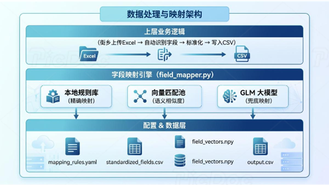

# 基于大模型与向量检索的市民热线工单数据自动标准化系统

  

## 📖 项目背景

市民热线工单 Excel 文件在流转过程中，常因来源不同、批次不同，导致字段命名极不一致（如同一含义字段出现“诉求内容”、“问题描述”、“工单详情”等不同名称）。这给后续的统计分析、考核剔除（如“平等民事主体纠纷”、“同一人重复反映”）带来了巨大阻碍，难以实现自动化处理。

本系统旨在构建一套**高自动化、低人工干预**的工单字段标准化系统，支持任意格式的 Excel 导入，自动映射到统一字段模型，并输出标准化 CSV，为后续考核分析与预警提供干净、标准的数据底座。

## ✨ 核心特性

- 🚀 **三阶段映射引擎**：精确匹配 ➡️ 向量检索 ➡️ 大模型兜底，兼顾速度与泛化能力。
- 🧠 **语义级字段对齐**：基于 `sentence-transformers` 解决“同一语义不同命名”的痛点。
- 🔄 **自动扩展与记忆**：大模型识别出的全新语义字段，自动追加至标准库与向量库，越用越聪明。
- 📊 **考核预警专项支持**：针对特定剔除场景自动打标，大幅减少人工复核工作量。

## 🛠️ 技术栈

| 类别 | 技术 / 工具 |
| :--- | :--- |
| **开发语言** | Python 3.13 |
| **依赖管理** | Poetry |
| **大语言模型** | GLM-4.5-Flash (通过 zai-sdk 接入) |
| **向量语义模型** | sentence-transformers |
| **数据处理** | Pandas, NumPy, scikit-learn, openpyxl |
| **配置与美化** | PyYAML, Rich |

## ⚙️ 系统架构与核心实现

系统核心采用**三阶段字段映射引擎**，由浅入深确保字段识别准确率：

### 1. 精确匹配层（快速）
基于 `mapping_rules.yaml` 维护的高频字段映射规则，毫秒级命中已知变体。
> 例：`"工单编号"` ➡️ `"ticket_id"`

### 2. 向量匹配层（精准）
使用 `sentence-transformers` 对字段名进行语义向量化，计算与标准字段库的余弦相似度。当阈值 `>0.85` 时自动完成映射，解决“同义不同名”问题。

### 3. 大模型兜底层（泛化）
对前两层无法匹配的疑难字段，调用 `GLM-4.5-Flash`，通过精心调优的 Prompt 引导模型判断字段语义并映射到标准字段，单字段映射成功率 `>96%`。

---

### 工程化与自动扩展机制
- **动态读取**：基于 `pandas + openpyxl` 动态解析任意 Excel 结构，不依赖固定列位置。
- **增量学习**：若大模型识别出全新语义字段，系统自动将其追加到标准字段库（CSV）及向量库（NPY），后续同类文件可直接命中，无需修改代码。

## 💾 数据与配置持久化

| 文件 | 说明 |
| :--- | :--- |
| `standardized_fields.csv` | 标准字段定义库 |
| `mapping_rules.yaml` | 精确映射规则配置 |
| `*.npy` | 字段向量库，支持新增字段后增量更新，无需全量重算 |

## 📈 项目成果与价值

- 🎯 **字段识别准确率**：精确+向量层覆盖 `>85%` 字段，大模型兜底后整体准确率 `>99%`。
- ⏱️ **人工介入量骤降**：原需 10分钟/文件 的字段对齐工作，缩短至 `<10秒/文件`。
- ♻️ **零代码扩展**：新增街乡文件时无需修改代码，系统自动完成字段匹配与模型更新。
- 🏢 **业务落地**：已用于 2025年7月考核期数据标准化，直接支撑后续考核剔除申报与预警分析。

## 💡 个人技术体现

- **Python 工程能力**：采用 Poetry + 模块化设计（`field_mapper` / `loader` / `writer`），结构清晰，支持长期维护。
- **大模型应用能力**：实际调优 GLM-4.5-Flash Prompt，精准处理字段语义歧义，避免幻觉。
- **向量检索实践**：脱离外部重型向量数据库，构建轻量级本地语义匹配池，极大降低部署成本。
- **自动化处理思维**：从传统的“一层映射”升级为“三阶段兜底”，实现了效率与泛化能力的完美平衡。

## 🚀 快速开始 (Quick Start)
下载压缩包，解压之后，可以直接点击exe文件运行。
如果要处理自己的excel工单，请编辑paht.json文件修改excel文件的路径，目前已经在./test/excel目录中放了测试文件

